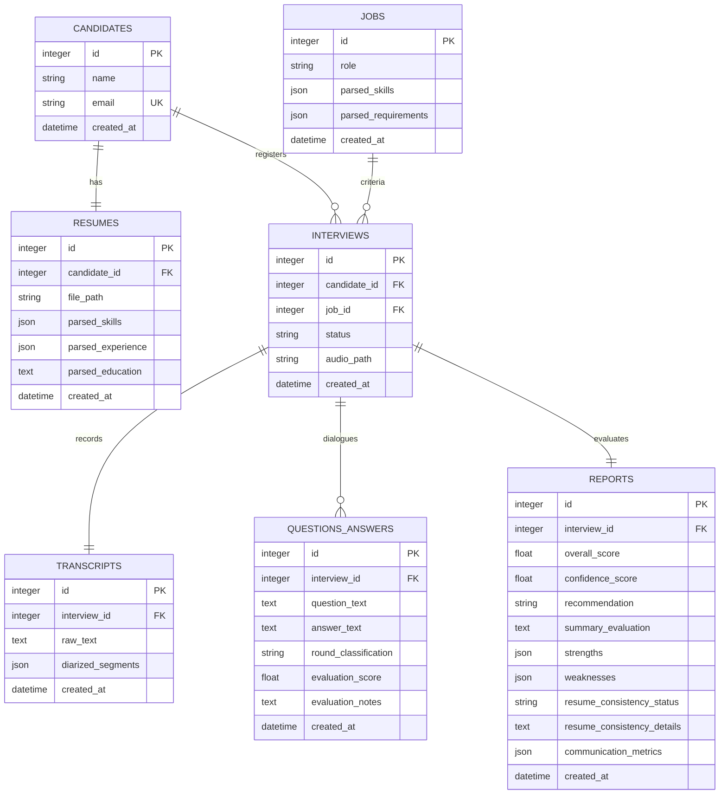

# Database Schema Documentation

This guide documents the relational PostgreSQL database tables, columns, indexes, and constraints.

---

## 1. ER Diagram (Mermaid)

---

## 2. Table Specifications

### Candidates Table (`candidates`)
Stores the primary identity details of candidates.
- `id` (INT, PK): Auto-incremented primary key.
- `name` (VARCHAR, REQUIRED): Display name.
- `email` (VARCHAR, UNIQUE): Mapped from resume.
- `created_at` (TIMESTAMP): Date registered.

### Resumes Table (`resumes`)
Stores parsed metadata of uploaded candidate resumes.
- `id` (INT, PK): Primary key.
- `candidate_id` (INT, FK -> `candidates.id` ON DELETE CASCADE)
- `file_path` (VARCHAR): Absolute path of the upload PDF/Word file.
- `parsed_skills` (JSON): Mapped skill array.
- `parsed_experience` (JSON): Chronological job roles and details.
- `parsed_education` (TEXT): Academic credentials.

### Jobs Table (`jobs`)
Stores target hiring specifications and requirements.
- `id` (INT, PK)
- `role` (VARCHAR): Job title (e.g. "Senior Python Engineer").
- `parsed_skills` (JSON): Core skills required.
- `parsed_requirements` (JSON): Work specifications.

### Interviews Table (`interviews`)
Orchestrates candidate-job slots and session status tracking.
- `id` (INT, PK)
- `candidate_id` (INT, FK -> `candidates.id` ON DELETE CASCADE)
- `job_id` (INT, FK -> `jobs.id` ON DELETE CASCADE)
- `status` (VARCHAR): State tracker (`created`, `recorded`, `transcribed`, `diarized`, `analyzed`).
- `audio_path` (VARCHAR): Storage path of uploaded audio.

### Transcripts Table (`transcripts`)
Stores speech-to-text diarization turns.
- `id` (INT, PK)
- `interview_id` (INT, FK -> `interviews.id` ON DELETE CASCADE)
- `raw_text` (TEXT): Continuous transcript.
- `diarized_segments` (JSON): Turn turns array (Interviewer vs. Candidate).

### Question Answers Table (`questions_answers`)
Stores segment-by-segment evaluations.
- `id` (INT, PK)
- `interview_id` (INT, FK -> `interviews.id` ON DELETE CASCADE)
- `question_text` (TEXT)
- `answer_text` (TEXT)
- `round_classification` (VARCHAR)
- `evaluation_score` (FLOAT)
- `evaluation_notes` (TEXT)

### Reports Table (`reports`)
Stores overall evaluator scores and statistics.
- `id` (INT, PK)
- `interview_id` (INT, FK -> `interviews.id` ON DELETE CASCADE)
- `overall_score` (FLOAT)
- `recommendation` (VARCHAR)
- `summary_evaluation` (TEXT)
- `strengths` (JSON)
- `weaknesses` (JSON)
- `resume_consistency_status` (VARCHAR)
- `resume_consistency_details` (TEXT)
- `communication_metrics` (JSON)
